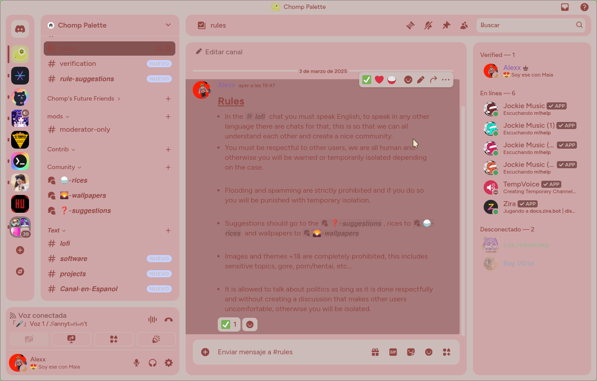
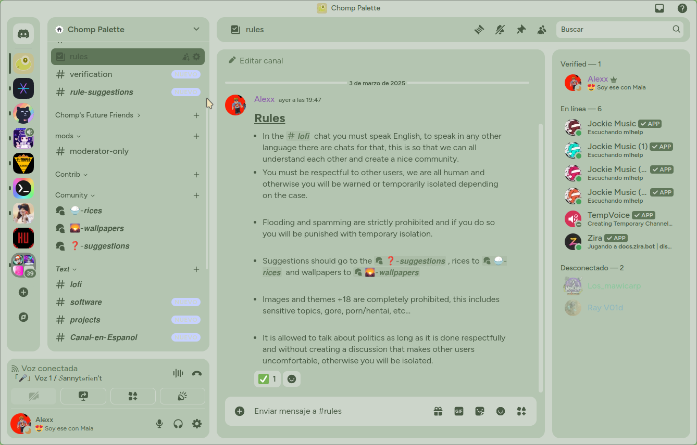
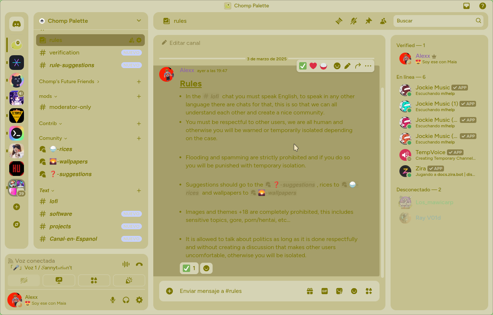
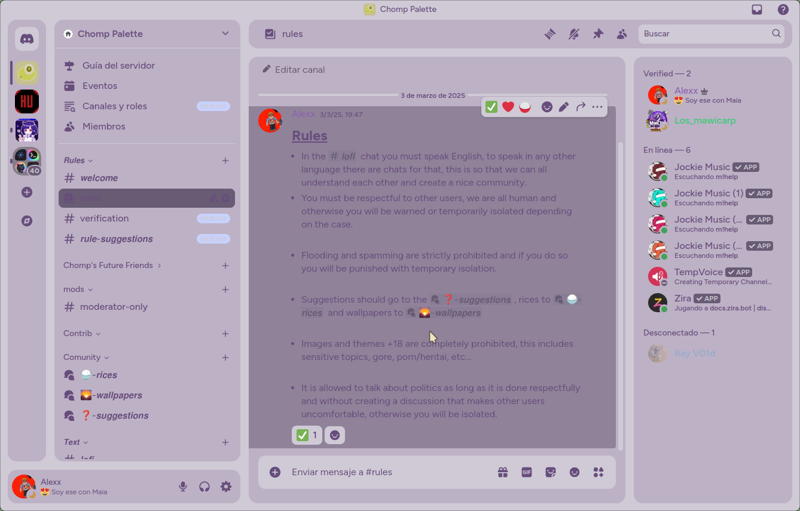

# Chompnight Discord
A recolor of the MIdnight-discord theme (Refact0r)

<details>
<summary>Red</summary>

</details>
<details>
<summary>Green</summary>

</details>
<details>
<summary>Yellow</summary>

</details>  
<details>
<summary>Purple</summary>

</details>

# Install
You must have Vencord or Better Discord installed. Then you put the following commands:

```
git clone https://github.com/Chomp-Palette/chompnight-discord.git
cd chompnight-discord
cp flavor/[chompnight-green-refresh.css|chompnight-red-refresh.css|chompnight-yellow-refresh.css|chompnight-purple-refresh.css] ~/.config/[Vencord|Discord]
```
# Thanks to...

Thanks to Refact0r for making the theme !
